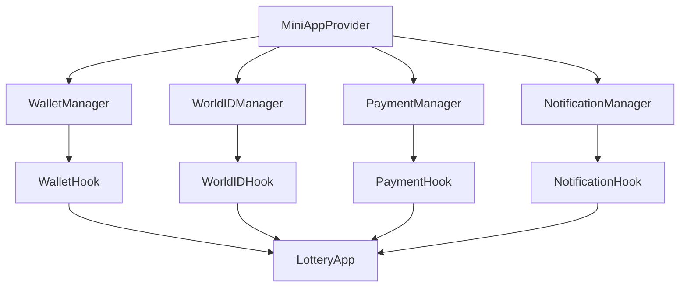
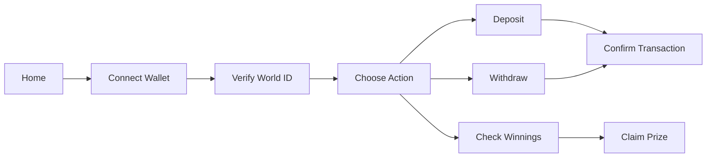

# MiniApp SDK Redesign for WLD Wallet Integration

## Overview

This design document outlines the comprehensive redesign of the MiniApp SDK to optimize integration with WLD wallet and enhance the user experience within the World App ecosystem. The redesign focuses on simplifying the SDK architecture, improving wallet connectivity, and creating a seamless demo experience.

### Current State Analysis

The existing implementation includes:

- Complex SDK architecture with multiple providers and components
- Enhanced features that may be over-engineered for core use cases
- Scattered components across different files
- Heavy abstraction layers that complicate debugging
- Multiple authentication flows that may confuse users

### Design Goals

1. **Simplification**: Streamline SDK architecture for better maintainability
2. **WLD Wallet Optimization**: Ensure seamless integration with WLD wallet functionality
3. **Demo Excellence**: Create compelling demo experience showcasing lottery features
4. **Performance**: Reduce bundle size and improve loading times
5. **Developer Experience**: Simplify API surface for easier integration

## Technology Stack & Dependencies

### Core Dependencies

- **@worldcoin/minikit-js**: ^1.9.6 (Primary SDK)
- **@worldcoin/idkit**: ^2.4.1 (World ID verification)
- **Next.js 15**: Frontend framework with app router
- **TypeScript**: Type safety and development experience
- **Tailwind CSS**: Styling and responsive design

### Supporting Libraries

- **Viem & Wagmi**: Blockchain interaction
- **Sonner**: Toast notifications
- **Lucide React**: Icons
- **Sentry**: Error monitoring

## Component Architecture

### Core SDK Components



### Component Hierarchy

#### 1. MiniAppProvider (Root Provider)

**Location**: `src/providers/miniapp-provider.tsx`

```typescript
interface MiniAppProviderProps {
  children: React.ReactNode;
  config: {
    appId: string;
    environment: "development" | "production";
    enableNotifications?: boolean;
    enableAnalytics?: boolean;
  };
}
```

**Responsibilities**:

- Initialize MiniKit SDK
- Manage global SDK state
- Provide context to child components
- Handle SDK errors and fallbacks

#### 2. WalletManager

**Location**: `src/components/wallet/wallet-manager.tsx`

**Features**:

- Simplified wallet connection flow
- Balance display and management
- Chain switching capabilities
- Connection state persistence

#### 3. WorldIDManager

**Location**: `src/components/worldid/worldid-manager.tsx`

**Features**:

- Streamlined verification process
- Proof caching and validation
- Human verification status tracking
- Integration with lottery eligibility

#### 4. PaymentManager

**Location**: `src/components/payment/payment-manager.tsx`

**Features**:

- WLD token transactions
- Deposit/withdrawal flows
- Transaction history
- Gas estimation and optimization

## Routing & Navigation

### Page Structure

```
/                    # Main lottery interface
/demo               # SDK feature demonstrations
/deposit            # Deposit WLD tokens
/withdraw           # Withdraw tokens
/admin              # Admin panel (draws, pool management)
```

### Navigation Flow



## State Management

### Unified State Architecture

#### Global State Structure

```typescript
interface MiniAppState {
  // SDK Status
  isInitialized: boolean;
  isWorldApp: boolean;
  error: string | null;

  // Wallet State
  wallet: {
    isConnected: boolean;
    address: string | null;
    balance: string;
    chainId: number;
  };

  // World ID State
  worldId: {
    isVerified: boolean;
    proof: WorldIDProof | null;
    verificationLevel: "orb" | "device" | null;
  };

  // Payment State
  payment: {
    isProcessing: boolean;
    lastTransaction: string | null;
    history: Transaction[];
  };

  // Lottery State
  lottery: {
    userDeposits: string;
    totalPool: string;
    nextDraw: Date | null;
    isEligible: boolean;
  };
}
```

#### State Management Pattern

- **React Context**: For global state sharing
- **useReducer**: For complex state transitions
- **Local State**: For component-specific UI state
- **Persistence**: localStorage for critical state

## API Integration Layer

### Simplified API Structure

#### Core Hooks

```typescript
// Wallet Management
const useWallet = () => ({
  connect: () => Promise<void>,
  disconnect: () => Promise<void>,
  getBalance: () => Promise<string>,
  isConnected: boolean,
  address: string | null,
  error: string | null,
});

// World ID Integration
const useWorldID = () => ({
  verify: (action: string) => Promise<WorldIDProof>,
  isVerified: boolean,
  proof: WorldIDProof | null,
  error: string | null,
});

// Payment Processing
const usePayment = () => ({
  sendWLD: (to: string, amount: string) => Promise<string>,
  deposit: (amount: string) => Promise<string>,
  withdraw: (amount: string) => Promise<string>,
  isProcessing: boolean,
  error: string | null,
});

// Lottery Integration
const useLottery = () => ({
  getPoolStats: () => Promise<PoolStats>,
  getUserStats: () => Promise<UserStats>,
  checkEligibility: () => Promise<boolean>,
  claimPrize: () => Promise<string>,
});
```

### API Endpoints Integration

```typescript
// Backend API routes
/api/auth/nonce          # SIWE nonce generation
/api/auth/verify         # Signature verification
/api/worldid/verify      # World ID proof verification
/api/lottery/stats       # Pool and user statistics
/api/lottery/draw        # Draw management
```

## Testing Strategy

### Testing Pyramid

#### 1. Unit Tests

**Coverage Target**: >90%
**Tools**: Jest, @testing-library/react

**Test Categories**:

- Hook functionality
- Component rendering
- State management
- Utility functions

#### 2. Integration Tests

**Tools**: Jest, MSW (Mock Service Worker)

**Test Scenarios**:

- Wallet connection flow
- World ID verification process
- Payment transactions
- Error handling and recovery

#### 3. End-to-End Tests

**Tools**: Playwright/Cypress

**User Journeys**:

- Complete lottery participation flow
- Deposit and withdrawal processes
- Admin panel operations
- Mobile responsiveness

### Test Environment Setup

```typescript
// Test configuration
const testConfig = {
  environment: "test",
  mockWallet: true,
  mockWorldID: true,
  testNetwork: "anvil",
  fixtures: {
    userAddress: "0x123...",
    worldIdProof: {
      /* mock proof */
    },
    poolBalance: "1000.0",
  },
};
```

## Enhanced Demo Experience

### Demo Page Redesign

**Location**: `/demo`

#### Interactive Sections

1. **Wallet Connection Demo**

   - Live connection status
   - Balance display
   - Network information
   - Connection troubleshooting

2. **World ID Verification Demo**

   - Step-by-step verification flow
   - Proof validation display
   - Verification history
   - Human verification badge

3. **Payment Processing Demo**

   - Send WLD transactions
   - Deposit simulation
   - Transaction monitoring
   - Gas estimation tools

4. **Lottery Integration Demo**
   - Pool statistics dashboard
   - User participation status
   - Prize claiming simulation
   - Draw automation showcase

### Demo Features

- **Live Data**: Real-time updates from testnet
- **Interactive Elements**: Clickable demos with immediate feedback
- **Error Simulation**: Demonstrate error handling
- **Performance Metrics**: Show SDK performance data
- **Mobile Optimization**: Touch-friendly interface

## Styling Strategy

### Design System

#### Color Palette

```css
:root {
  --wld-primary: #000000; /* World App black */
  --wld-secondary: #4f46e5; /* Indigo accent */
  --wld-success: #10b981; /* Green for success */
  --wld-warning: #f59e0b; /* Amber for warnings */
  --wld-error: #ef4444; /* Red for errors */
  --wld-gray-50: #f9fafb; /* Light backgrounds */
  --wld-gray-900: #111827; /* Dark text */
}
```

#### Typography Scale

```css
.text-display {
  font-size: 2.25rem; /* 36px - Main headers */
  font-weight: 800;
  line-height: 1.2;
}

.text-heading {
  font-size: 1.5rem; /* 24px - Section headers */
  font-weight: 600;
  line-height: 1.3;
}

.text-body {
  font-size: 1rem; /* 16px - Body text */
  font-weight: 400;
  line-height: 1.5;
}

.text-caption {
  font-size: 0.875rem; /* 14px - Captions */
  font-weight: 400;
  line-height: 1.4;
}
```

#### Component Styling

- **Tailwind CSS**: Utility-first approach
- **CSS Custom Properties**: Design tokens
- **Responsive Design**: Mobile-first approach
- **Dark Mode**: System preference detection

### Responsive Breakpoints

```css
/* Mobile First Approach */
sm: 640px   /* Small tablets */
md: 768px   /* Tablets */
lg: 1024px  /* Laptops */
xl: 1280px  /* Desktops */
```

## Performance Optimization

### Bundle Optimization

#### Code Splitting Strategy

```typescript
// Dynamic imports for heavy components
const AdminPanel = lazy(() => import("./components/admin/admin-panel"));
const LotteryStats = lazy(() => import("./components/lottery/lottery-stats"));

// Route-based splitting
const routes = [
  { path: "/", component: lazy(() => import("./pages/home")) },
  { path: "/demo", component: lazy(() => import("./pages/demo")) },
  { path: "/admin", component: lazy(() => import("./pages/admin")) },
];
```

#### Critical Resource Loading

```typescript
// Preload critical resources
const preloadResources = [
  '@worldcoin/minikit-js',
  './wallet-manager',
  './worldid-manager'
];

// Resource hints in HTML head
<link rel="preload" href="/api/lottery/stats" as="fetch" crossorigin />
<link rel="prefetch" href="/admin" />
```

### Runtime Performance

#### Optimization Techniques

- **Memoization**: React.memo, useMemo, useCallback
- **Virtualization**: For large transaction lists
- **Debouncing**: User input handling
- **Image Optimization**: Next.js Image component
- **Service Worker**: Caching strategy

#### Performance Monitoring

```typescript
// Performance metrics collection
const performanceMetrics = {
  walletConnectionTime: number;
  worldIdVerificationTime: number;
  transactionProcessingTime: number;
  pageLoadTime: number;
  bundleSize: number;
};
```

## Security Considerations

### Authentication & Authorization

#### Multi-Layer Security

1. **MiniKit Integration**: Native World App security
2. **SIWE (Sign-In with Ethereum)**: Wallet-based authentication
3. **World ID Verification**: Human verification layer
4. **Rate Limiting**: API endpoint protection

#### Security Implementation

```typescript
// Secure authentication flow
const secureAuth = {
  walletAuth: async () => {
    const nonce = await fetchSecureNonce();
    const signature = await signMessage(nonce);
    return verifySignature(signature, nonce);
  },

  worldIdAuth: async (action: string) => {
    const proof = await generateWorldIDProof(action);
    return verifyWorldIDProof(proof);
  },
};
```

### Data Protection

- **Input Validation**: All user inputs sanitized
- **XSS Prevention**: Content Security Policy (CSP)
- **CSRF Protection**: Token-based protection
- **Secure Storage**: Sensitive data encryption

### Error Handling

```typescript
// Secure error handling
const errorHandler = {
  sanitizeError: (error: Error) => ({
    code: error.code,
    message: getSafeErrorMessage(error),
    timestamp: Date.now(),
  }),

  logSecurely: (error: Error) => {
    // Log without exposing sensitive data
    logger.error("SDK Error", {
      code: error.code,
      userAgent: navigator.userAgent,
      timestamp: Date.now(),
    });
  },
};
```

## Implementation Roadmap

### Phase 1: Core Infrastructure (Week 1-2)

**Deliverables**:

- [ ] Simplified MiniAppProvider implementation
- [ ] Core hooks (useWallet, useWorldID, usePayment)
- [ ] Basic error handling and logging
- [ ] Unit test framework setup

**Success Criteria**:

- Wallet connection works in World App
- World ID verification functional
- Basic payment processing operational

### Phase 2: Enhanced Integration (Week 3-4)

**Deliverables**:

- [ ] Lottery-specific hooks and components
- [ ] Transaction history and state management
- [ ] Responsive UI components
- [ ] Integration test suite

**Success Criteria**:

- Complete deposit/withdrawal flow
- Real-time lottery statistics
- Mobile-optimized interface

### Phase 3: Demo & Documentation (Week 5-6)

**Deliverables**:

- [ ] Interactive demo page
- [ ] Performance optimization
- [ ] Comprehensive documentation
- [ ] End-to-end testing

**Success Criteria**:

- Compelling demo experience
- <2s initial load time
- > 95% test coverage
- Production-ready deployment

### Phase 4: Production Hardening (Week 7-8)

**Deliverables**:

- [ ] Security audit and fixes
- [ ] Performance monitoring
- [ ] Error tracking integration
- [ ] Production deployment

**Success Criteria**:

- Security vulnerabilities addressed
- Performance metrics monitoring
- Error rates <0.1%
- Successful production launch
