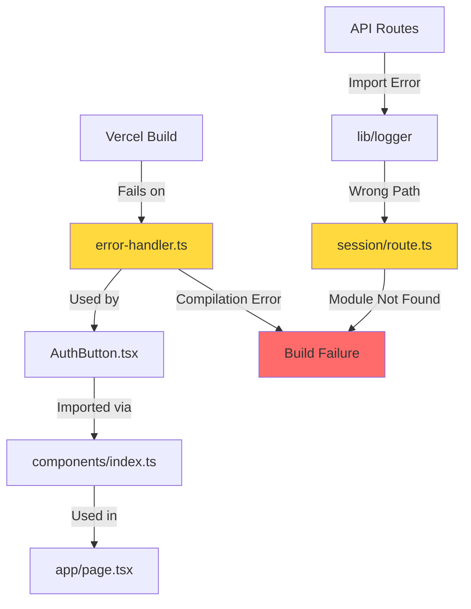

# Vercel Build Error Fix Design

## Overview

This design addresses critical build errors preventing successful Vercel deployment of the Worldcoin PoolTogether MiniApp. The errors stem from TypeScript syntax issues and incorrect module import paths that must be resolved to restore deployment functionality.

## Error Analysis

### Primary Issues Identified

1. **Syntax Error in error-handler.ts**: Unicode escape sequence corruption at line 289
2. **Module Resolution Error**: Incorrect import path `../../../../../lib/logger` in session route
3. **File Corruption**: The error-handler.ts file contains malformed content with broken Unicode sequences

### Build Environment Context

- **Platform**: Vercel deployment (Washington, D.C. - iad1)
- **Next.js Version**: 15.4.6
- **Build Tool**: Next.js with Turbopack
- **TypeScript**: Strict mode enforcement
- **Error Location**: Compilation phase during `next build`

## Architecture Impact

### Affected Components



### Module Dependency Chain

The error-handler.ts file serves as a critical utility imported across multiple components:

- Authentication components (AuthButton.tsx)
- API routes (session management)
- Error boundaries and user feedback systems

## Technical Resolution Strategy

### 1. File Content Restoration

**Problem**: The error-handler.ts file contains corrupted Unicode sequences causing compilation failure.

**Solution**:

- Clean reconstruction of the ErrorHandler class
- Proper TypeScript type definitions
- Removal of malformed Unicode escape sequences
- Maintenance of existing API surface

### 2. Import Path Correction

**Problem**: Session route uses incorrect relative path `../../../../../lib/logger`

**Current Path**: `src/app/api/auth/session/route.ts` → `../../../../../lib/logger`
**Correct Path**: `src/app/api/auth/session/route.ts` → `../../../../lib/logger`

**Resolution Method**:

- Update import statement to use correct relative path
- Verify module resolution compatibility
- Ensure TypeScript can locate the logger module

### 3. Code Quality Standards

**Requirements**:

- Maintain TypeScript strict mode compliance
- Preserve existing error handling functionality
- Follow project coding standards
- Ensure Edge runtime compatibility

## Implementation Architecture

### Error Handler Module Design

```typescript
// Core Types
export enum AuthErrorType {
  NETWORK_TIMEOUT = "NETWORK_TIMEOUT",
  RPC_ERROR = "RPC_ERROR",
  USER_REJECTED = "USER_REJECTED",
  // ... other types
}

export interface EnhancedError {
  type: AuthErrorType;
  code: string;
  message: string;
  severity: ErrorSeverity;
  retryable: boolean;
  recoveryAction: RecoveryAction;
  timestamp: Date;
  context?: string;
  details: Record<string, unknown>;
}

// Singleton Error Handler
export class ErrorHandler {
  private static instance: ErrorHandler;
  private errorHistory: EnhancedError[] = [];

  static getInstance(): ErrorHandler;
  createError(input: string | Error | AuthErrorType): EnhancedError;
  // ... other methods
}
```

### Session Route Module Structure

```typescript
import { NextResponse } from "next/server";
import { logger } from "../../../../lib/logger"; // Corrected path

interface SessionData {
  address: string;
  issuedAt: number;
  expiresAt: number;
  // ... other properties
}

export async function GET(req: Request) {
  // Session validation logic
}

export async function POST(req: Request) {
  // Session creation logic
}
```

## File Modifications Required

### Priority 1: Critical Fixes

1. **src/lib/error-handler.ts**

   - Remove corrupted Unicode sequences
   - Restore proper class structure
   - Maintain existing public API
   - Fix TypeScript compilation errors

2. **src/app/api/auth/session/route.ts**
   - Correct logger import path from `../../../../../lib/logger` to `../../../../lib/logger`
   - Verify crypto.randomUUID() compatibility with Edge runtime

### Priority 2: Validation

1. **Type checking**: Ensure all TypeScript types are properly defined
2. **Import resolution**: Verify all module paths resolve correctly
3. **Build compatibility**: Test Edge runtime compatibility

## Quality Assurance

### Build Validation Process

```bash
# Local validation commands
npm run type-check    # TypeScript compilation
npm run lint         # ESLint validation
npm run build        # Next.js build test
```

### Testing Strategy

1. **Compilation Test**: Verify TypeScript compilation succeeds
2. **Module Resolution**: Confirm all imports resolve correctly
3. **Runtime Test**: Ensure API routes function in Edge runtime
4. **Integration Test**: Validate error handling functionality

## Risk Mitigation

### Potential Issues

1. **API Surface Changes**: Risk of breaking existing error handling calls
2. **Type Definition Changes**: Potential TypeScript compilation issues in dependent files
3. **Runtime Compatibility**: Edge runtime restrictions on Node.js APIs

### Mitigation Strategies

1. **Preserve Public API**: Maintain existing method signatures
2. **Incremental Testing**: Test each fix independently
3. **Fallback Plan**: Keep backup of working configuration
4. **Edge Runtime Compliance**: Use only supported APIs like crypto.randomUUID()

## Dependencies Impact

### Internal Dependencies

- **Logger Module**: src/lib/logger.ts (target of incorrect import)
- **Component System**: Authentication components depending on error-handler
- **API Routes**: Session management and authentication endpoints

### External Dependencies

- **Next.js 15.4.6**: Build system and routing
- **TypeScript**: Strict type checking
- **Vercel Platform**: Deployment target with Edge runtime

## Monitoring and Validation

### Success Criteria

1. ✅ Vercel build completes successfully
2. ✅ All TypeScript compilation errors resolved
3. ✅ Module imports resolve correctly
4. ✅ API routes function in production
5. ✅ Error handling maintains functionality

### Post-Fix Verification

1. **Build Logs**: Monitor Vercel deployment logs for errors
2. **Runtime Testing**: Verify API endpoints respond correctly
3. **Error Tracking**: Ensure error handling functions as expected
4. **Performance**: Confirm no regression in build times```typescript
   import { NextResponse } from 'next/server';
   import { logger } from '../../../../lib/logger'; // Corrected path

interface SessionData {
address: string;
issuedAt: number;
expiresAt: number;
// ... other properties
}

export async function GET(req: Request) {
// Session validation logic
}

export async function POST(req: Request) {
// Session creation logic
}

````

## File Modifications Required

### Priority 1: Critical Fixes
1. **src/lib/error-handler.ts**
   - Remove corrupted Unicode sequences
   - Restore proper class structure
   - Maintain existing public API
   - Fix TypeScript compilation errors

2. **src/app/api/auth/session/route.ts**
   - Correct logger import path from `../../../../../lib/logger` to `../../../../lib/logger`
   - Verify crypto.randomUUID() compatibility with Edge runtime

### Priority 2: Validation
1. **Type checking**: Ensure all TypeScript types are properly defined
2. **Import resolution**: Verify all module paths resolve correctly
3. **Build compatibility**: Test Edge runtime compatibility

## Quality Assurance

### Build Validation Process
```bash
# Local validation commands
npm run type-check    # TypeScript compilation
npm run lint         # ESLint validation
npm run build        # Next.js build test
````

### Testing Strategy

1. **Compilation Test**: Verify TypeScript compilation succeeds
2. **Module Resolution**: Confirm all imports resolve correctly
3. **Runtime Test**: Ensure API routes function in Edge runtime
4. **Integration Test**: Validate error handling functionality

## Risk Mitigation

### Potential Issues

1. **API Surface Changes**: Risk of breaking existing error handling calls
2. **Type Definition Changes**: Potential TypeScript compilation issues in dependent files
3. **Runtime Compatibility**: Edge runtime restrictions on Node.js APIs

### Mitigation Strategies

1. **Preserve Public API**: Maintain existing method signatures
2. **Incremental Testing**: Test each fix independently
3. **Fallback Plan**: Keep backup of working configuration
4. **Edge Runtime Compliance**: Use only supported APIs like crypto.randomUUID()

## Dependencies Impact

### Internal Dependencies

- **Logger Module**: src/lib/logger.ts (target of incorrect import)
- **Component System**: Authentication components depending on error-handler
- **API Routes**: Session management and authentication endpoints

### External Dependencies

- **Next.js 15.4.6**: Build system and routing
- **TypeScript**: Strict type checking
- **Vercel Platform**: Deployment target with Edge runtime

## Monitoring and Validation

### Success Criteria

1. ✅ Vercel build completes successfully
2. ✅ All TypeScript compilation errors resolved
3. ✅ Module imports resolve correctly
4. ✅ API routes function in production
5. ✅ Error handling maintains functionality

### Post-Fix Verification

1. **Build Logs**: Monitor Vercel deployment logs for errors
2. **Runtime Testing**: Verify API endpoints respond correctly
3. **Error Tracking**: Ensure error handling functions as expected
4. **Performance**: Confirm no regression in build times
