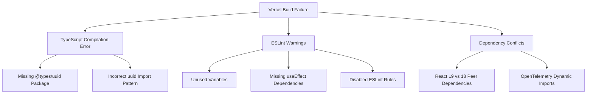
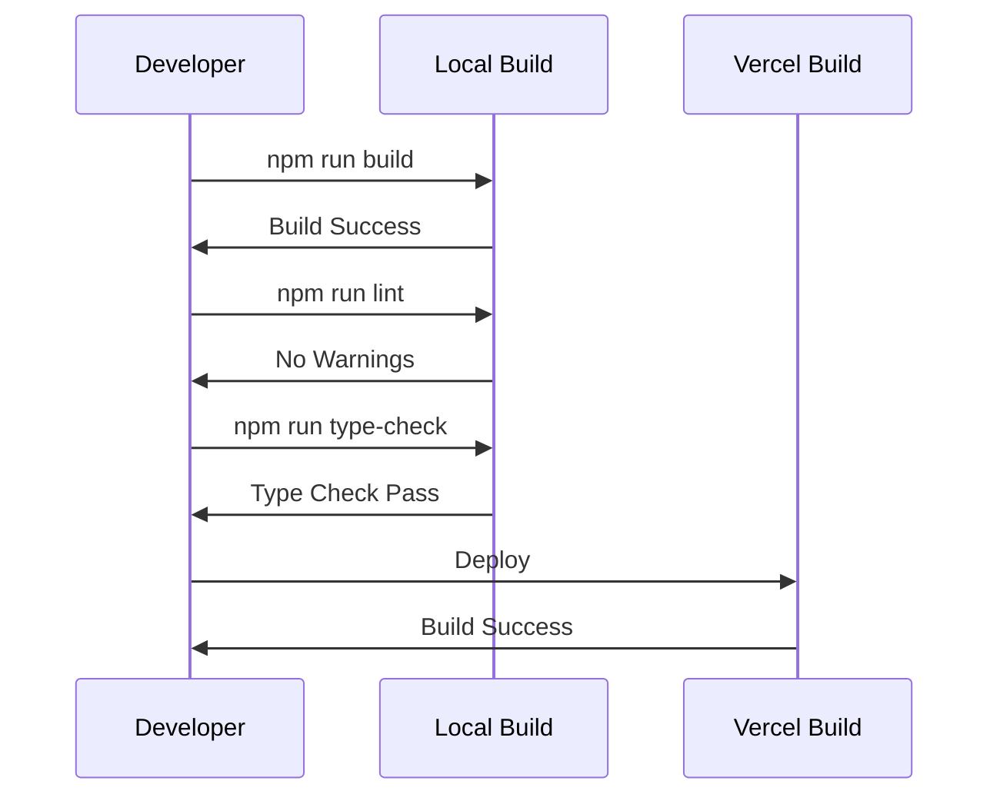

# Vercel Build Fix Design Document

## Overview

This document addresses the Vercel build failure affecting the Next.js 15 application. The primary issue is a TypeScript compilation error related to missing type declarations for the `uuid` module, along with several ESLint warnings that could impact build stability.

## Problem Analysis

### Primary Build Error

```
Type error: Could not find a declaration file for module 'uuid'.
'/vercel/path0/node_modules/uuid/dist/esm-browser/index.js' implicitly has an 'any' type.
Try `npm i --save-dev @types/uuid` if it exists or add a new declaration (.d.ts) file containing `declare module 'uuid';`
```

### Secondary Issues

- Multiple ESLint warnings about unused variables and missing dependencies
- Dependency resolution warnings for React version conflicts
- Critical dependency warnings from OpenTelemetry instrumentation

## Root Cause Analysis



## Solution Architecture

### 1. TypeScript Declaration Fix

**Approach**: Install missing type declarations and update import patterns

**Implementation Strategy**:

- Add `@types/uuid` to devDependencies
- Ensure proper ESM import usage
- Consider alternative UUID generation for Edge runtime compatibility

### 2. Code Quality Improvements

**Approach**: Systematic cleanup of unused variables and dependency warnings

**Categories**:

- Remove unused imports and variables
- Fix React Hook dependency arrays
- Add proper type annotations where needed

### 3. Build Configuration Optimization

**Approach**: Configure Next.js and TypeScript for better Edge runtime compatibility

## Implementation Plan

### Phase 1: Immediate Build Fix

#### 1.1 Package Dependencies

```json
{
  "devDependencies": {
    "@types/uuid": "^10.0.0"
  }
}
```

#### 1.2 UUID Module Usage

Replace current uuid import with Edge runtime compatible alternatives:

**Option A**: Native Crypto API

```typescript
// Replace: import { v4 as uuidv4 } from 'uuid';
// With: crypto.randomUUID() for Edge runtime
```

**Option B**: Keep uuid with proper types

```typescript
import { v4 as uuidv4 } from "uuid";
// Ensure @types/uuid is installed
```

### Phase 2: Code Quality Cleanup

#### 2.1 Authentication API Cleanup

**Target File**: `src/app/api/auth/verify/route.ts`

**Issues to Fix**:

- Remove unused uuid import if using crypto.randomUUID()
- Clean up unused variables in verification logic

#### 2.2 Component Cleanup Strategy

**Systematic approach for multiple components**:


**Priority Components**:

- `enhanced-sdk.test.tsx` - Remove unused imports
- `simplified-sdk.test.tsx` - Fix React Hook dependencies
- `enhanced-*.tsx` components - Comprehensive cleanup

#### 2.3 Dependency Array Fixes

**Pattern for useEffect fixes**:

```typescript
// Before (missing dependencies)
useEffect(() => {
  someFunction();
}, []);

// After (complete dependencies)
useEffect(() => {
  someFunction();
}, [someFunction]);
```

### Phase 3: Build Configuration Enhancement

#### 3.1 Next.js Configuration

**Enhance**: `next.config.mjs` for better build reliability

```javascript
const nextConfig = {
  typescript: {
    ignoreBuildErrors: false, // Keep strict
  },
  eslint: {
    ignoreDuringBuilds: false, // Fix warnings instead of ignoring
  },
  experimental: {
    esmExternals: true, // Better ESM handling
  },
};
```

#### 3.2 TypeScript Configuration

**Optional Enhancement**: Add strict null checks if not already enabled

```json
{
  "compilerOptions": {
    "strict": true,
    "noUnusedLocals": true,
    "noUnusedParameters": true
  }
}
```

## Testing Strategy

### Build Validation Process



### Validation Checklist

1. **Local Build**: `npm run build` succeeds without errors
2. **Type Check**: `npm run type-check` passes
3. **Linting**: `npm run lint` shows no warnings
4. **Test Suite**: `npm run test` passes
5. **Edge Runtime**: No runtime errors in Edge functions

## Risk Assessment

### Low Risk Changes

- Adding `@types/uuid` dependency
- Removing unused variables
- Fixing obvious useEffect dependencies

### Medium Risk Changes

- Replacing uuid with crypto.randomUUID()
- Modifying test files with many warnings

### Mitigation Strategies

- **Incremental Deployment**: Fix one category at a time
- **Rollback Plan**: Keep current working version tagged
- **Testing**: Comprehensive local testing before Vercel deployment

## Success Criteria

### Primary Goals

- ✅ Vercel build completes successfully
- ✅ No TypeScript compilation errors
- ✅ Zero critical ESLint warnings

### Secondary Goals

- ✅ Improved code quality metrics
- ✅ Better build performance
- ✅ Enhanced maintainability

## Monitoring and Validation

### Build Metrics

- Build time improvement
- Bundle size optimization
- Error reduction in Sentry

### Code Quality Metrics

- ESLint warning count: Target 0
- TypeScript strict mode compliance
- Test coverage maintenance

## Implementation Priority

### Critical Path (P0)

1. Install `@types/uuid` package
2. Fix uuid import in auth API
3. Deploy and validate build success

### High Priority (P1)

4. Clean up major component warnings
5. Fix useEffect dependency arrays
6. Remove unused variables

### Medium Priority (P2)

7. Optimize build configuration
8. Enhance type safety
9. Performance optimizations

This design provides a systematic approach to resolving the Vercel build failure while improving overall code quality and maintainability.
