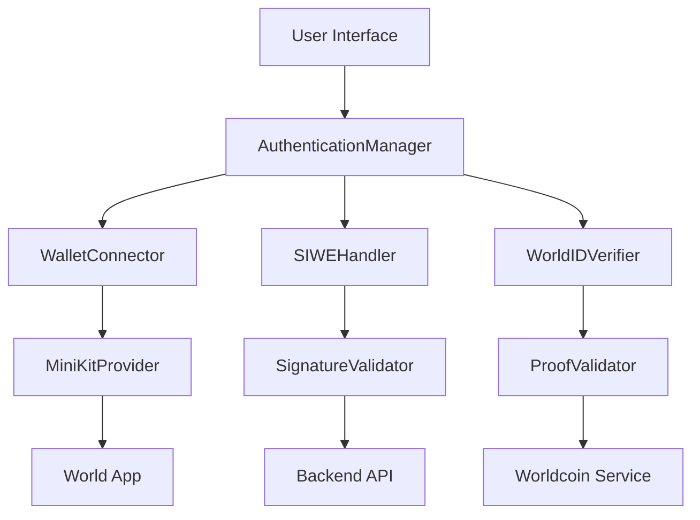
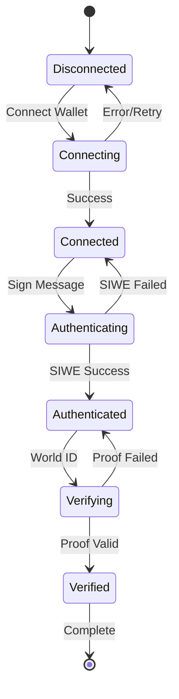

# WLD SDK Integration Best Practices

## Overview

This document outlines best practices for integrating the Worldcoin (WLD) SDK to resolve signature verification failures and establish a robust, production-ready authentication flow. The design addresses the recurring "signature verification failed" errors and provides a comprehensive solution for wallet connection, SIWE authentication, and World ID verification.

## Technology Stack & Dependencies

### Core Technologies

- **MiniKit SDK**: Worldcoin's JavaScript SDK for World App integration
- **Viem**: Ethereum interaction library for signature verification
- **SIWE (Sign-In with Ethereum)**: EIP-4361 standard for wallet authentication
- **Next.js**: Application framework with Edge Runtime support
- **TypeScript**: For type safety and development experience

### Key Dependencies

```json
{
  "@worldcoin/minikit-js": "^1.0.0",
  "viem": "^2.0.0",
  "@worldcoin/idkit": "^1.0.0"
}
```

## Component Architecture

### Authentication Flow Components



#### Component Definitions

**AuthenticationManager**

- Central orchestrator for the authentication flow
- Manages state transitions between wallet connection, SIWE, and World ID
- Handles error recovery and retry mechanisms
- Provides unified interface for authentication status

**WalletConnector**

- Handles MiniKit wallet connection
- Manages wallet state and chain configuration
- Implements connection retry logic with exponential backoff
- Validates wallet compatibility and network requirements

**SIWEHandler**

- Generates and validates SIWE messages according to EIP-4361
- Manages nonce lifecycle and expiration
- Handles signature verification with proper error handling
- Implements rate limiting and replay attack prevention

**WorldIDVerifier**

- Manages World ID verification flow
- Handles IDKit integration and proof validation
- Implements verification status persistence
- Provides fallback mechanisms for verification failures

## Routing & Navigation

### Authentication States



### Error Recovery Flows

- **Connection Timeout**: Automatic retry with increasing delays
- **Signature Rejection**: Clear error message and retry option
- **Network Issues**: Fallback to alternative RPC endpoints
- **Verification Failures**: Detailed error reporting and manual retry

## State Management

### Authentication State Schema

```typescript
interface AuthenticationState {
  wallet: {
    isConnected: boolean;
    address: string | null;
    chainId: number | null;
    isConnecting: boolean;
    connectionAttempts: number;
    lastError: string | null;
  };
  siwe: {
    nonce: string | null;
    message: string | null;
    signature: string | null;
    isAuthenticated: boolean;
    isAuthenticating: boolean;
    attempts: number;
    lastVerificationTime: number | null;
  };
  worldId: {
    isVerified: boolean;
    isVerifying: boolean;
    nullifierHash: string | null;
    verificationLevel: "orb" | "device" | null;
    lastVerificationTime: number | null;
  };
  session: {
    isActive: boolean;
    expiresAt: number | null;
    sessionId: string | null;
  };
}
```

### State Management Patterns

- **Immutable Updates**: All state changes through pure functions
- **Optimistic Updates**: UI updates immediately with rollback on failure
- **Persistence**: Critical authentication state persisted to localStorage
- **Synchronization**: Real-time sync between tabs using BroadcastChannel

## API Integration Layer

### SIWE Endpoints Architecture

#### Nonce Generation Endpoint

```typescript
// GET /api/siwe/nonce
interface NonceResponse {
  nonce: string;
  expirationTime: string;
  requestId: string;
}
```

**Implementation Requirements:**

- Generate cryptographically secure 32-byte random nonce
- Set 15-minute expiration window
- Store nonce with expiration in memory/database
- Return consistent format with proper CORS headers

#### Signature Verification Endpoint

```typescript
// POST /api/siwe/verify
interface VerificationRequest {
  address: string;
  message: string;
  signature: string;
  nonce: string;
}

interface VerificationResponse {
  ok: boolean;
  error?: string;
  sessionId?: string;
}
```

**Enhanced Verification Logic:**

```typescript
async function verifySignature(
  request: VerificationRequest
): Promise<VerificationResponse> {
  // 1. Validate input parameters
  const validation = validateInputs(request);
  if (!validation.valid) {
    return { ok: false, error: validation.error };
  }

  // 2. Verify nonce is valid and not expired
  const nonceValid = await validateNonce(request.nonce);
  if (!nonceValid) {
    return { ok: false, error: "InvalidNonce" };
  }

  // 3. Parse and validate SIWE message structure
  const siweMessage = parseSIWEMessage(request.message);
  if (!siweMessage) {
    return { ok: false, error: "InvalidSIWEFormat" };
  }

  // 4. Verify signature cryptographically
  const signatureValid = await verifyMessage({
    address: request.address,
    message: request.message,
    signature: request.signature,
  });

  if (!signatureValid) {
    return { ok: false, error: "SignatureInvalid" };
  }

  // 5. Create authenticated session
  const sessionId = await createSession(request.address);

  return { ok: true, sessionId };
}
```

### World ID Integration Endpoints

#### Verification Endpoint

```typescript
// POST /api/worldid/verify
interface WorldIDRequest {
  proof: string;
  nullifier_hash: string;
  merkle_root: string;
  verification_level: "orb" | "device";
  signal?: string;
}
```

## Enhanced Error Handling & Recovery

### Error Classification System

```typescript
enum AuthErrorType {
  // Network Errors
  NETWORK_TIMEOUT = "NETWORK_TIMEOUT",
  RPC_ERROR = "RPC_ERROR",
  API_UNAVAILABLE = "API_UNAVAILABLE",

  // Wallet Errors
  WALLET_NOT_FOUND = "WALLET_NOT_FOUND",
  WALLET_LOCKED = "WALLET_LOCKED",
  USER_REJECTED = "USER_REJECTED",

  // SIWE Errors
  INVALID_NONCE = "INVALID_NONCE",
  SIGNATURE_INVALID = "SIGNATURE_INVALID",
  MESSAGE_EXPIRED = "MESSAGE_EXPIRED",

  // World ID Errors
  PROOF_INVALID = "PROOF_INVALID",
  VERIFICATION_FAILED = "VERIFICATION_FAILED",
  ALREADY_VERIFIED = "ALREADY_VERIFIED",
}
```

### Recovery Strategies

**Exponential Backoff for Network Errors:**

```typescript
class RetryManager {
  private attempts = 0;
  private maxAttempts = 3;
  private baseDelay = 1000;

  async executeWithRetry<T>(operation: () => Promise<T>): Promise<T> {
    while (this.attempts < this.maxAttempts) {
      try {
        return await operation();
      } catch (error) {
        this.attempts++;
        if (this.attempts >= this.maxAttempts) throw error;

        const delay = this.baseDelay * Math.pow(2, this.attempts - 1);
        await new Promise((resolve) => setTimeout(resolve, delay));
      }
    }
    throw new Error("Max retry attempts exceeded");
  }
}
```

**Circuit Breaker Pattern for API Calls:**

```typescript
class CircuitBreaker {
  private failures = 0;
  private lastFailureTime = 0;
  private threshold = 5;
  private timeout = 60000; // 1 minute

  async call<T>(operation: () => Promise<T>): Promise<T> {
    if (this.isOpen()) {
      throw new Error("Circuit breaker is open");
    }

    try {
      const result = await operation();
      this.onSuccess();
      return result;
    } catch (error) {
      this.onFailure();
      throw error;
    }
  }

  private isOpen(): boolean {
    return (
      this.failures >= this.threshold &&
      Date.now() - this.lastFailureTime < this.timeout
    );
  }
}
```

## Security Considerations

### Input Validation & Sanitization

**SIWE Message Validation:**

```typescript
function validateSIWEMessage(message: string): ValidationResult {
  const siwePattern =
    /^(.+) wants you to sign in with your Ethereum account:\n(0x[a-fA-F0-9]{40})\n\n(.+)\n\nURI: (.+)\nVersion: (\d+)\nChain ID: (\d+)\nNonce: ([a-fA-F0-9]{64})\nIssued At: (.+)$/;

  const match = message.match(siwePattern);
  if (!match) {
    return { valid: false, error: "Invalid SIWE message format" };
  }

  const [, domain, address, statement, uri, version, chainId, nonce, issuedAt] =
    match;

  // Validate each component
  if (!isValidDomain(domain)) return { valid: false, error: "Invalid domain" };
  if (!isValidAddress(address))
    return { valid: false, error: "Invalid address" };
  if (version !== "1")
    return { valid: false, error: "Unsupported SIWE version" };
  if (!isValidChainId(chainId))
    return { valid: false, error: "Invalid chain ID" };
  if (!isValidNonce(nonce))
    return { valid: false, error: "Invalid nonce format" };
  if (!isValidTimestamp(issuedAt))
    return { valid: false, error: "Invalid timestamp" };

  return { valid: true };
}
```

### Rate Limiting & DDoS Protection

```typescript
class RateLimiter {
  private attempts = new Map<string, number[]>();
  private maxAttempts = 10;
  private windowMs = 900000; // 15 minutes

  isAllowed(identifier: string): boolean {
    const now = Date.now();
    const userAttempts = this.attempts.get(identifier) || [];

    // Remove old attempts outside the window
    const recentAttempts = userAttempts.filter(
      (time) => now - time < this.windowMs
    );

    if (recentAttempts.length >= this.maxAttempts) {
      return false;
    }

    recentAttempts.push(now);
    this.attempts.set(identifier, recentAttempts);
    return true;
  }
}
```

### Session Management

```typescript
interface AuthSession {
  sessionId: string;
  address: string;
  issuedAt: number;
  expiresAt: number;
  isWorldIDVerified: boolean;
  permissions: string[];
}

class SessionManager {
  private sessions = new Map<string, AuthSession>();
  private sessionDuration = 24 * 60 * 60 * 1000; // 24 hours

  createSession(address: string, isWorldIDVerified = false): string {
    const sessionId = crypto.randomUUID();
    const now = Date.now();

    this.sessions.set(sessionId, {
      sessionId,
      address,
      issuedAt: now,
      expiresAt: now + this.sessionDuration,
      isWorldIDVerified,
      permissions: ["basic"],
    });

    return sessionId;
  }

  validateSession(sessionId: string): AuthSession | null {
    const session = this.sessions.get(sessionId);
    if (!session || session.expiresAt < Date.now()) {
      if (session) this.sessions.delete(sessionId);
      return null;
    }
    return session;
  }
}
```

## Performance Optimization

### Connection Pooling & Caching

```typescript
class RPCManager {
  private pools = new Map<string, RPCPool>();
  private fallbackUrls = [
    "https://worldchain-sepolia.g.alchemy.com/v2/demo",
    "https://worldchain-sepolia.infura.io/v3/demo",
  ];

  async call(method: string, params: any[]): Promise<any> {
    for (const url of this.fallbackUrls) {
      try {
        const pool = this.getPool(url);
        return await pool.call(method, params);
      } catch (error) {
        console.warn(`RPC call failed for ${url}:`, error);
        continue;
      }
    }
    throw new Error("All RPC endpoints failed");
  }

  private getPool(url: string): RPCPool {
    if (!this.pools.has(url)) {
      this.pools.set(url, new RPCPool(url, { maxConnections: 10 }));
    }
    return this.pools.get(url)!;
  }
}
```

### Response Caching Strategy

```typescript
class AuthCache {
  private cache = new Map<string, CacheEntry>();
  private defaultTTL = 300000; // 5 minutes

  set(key: string, value: any, ttl = this.defaultTTL): void {
    this.cache.set(key, {
      value,
      expiresAt: Date.now() + ttl,
    });
  }

  get(key: string): any | null {
    const entry = this.cache.get(key);
    if (!entry || entry.expiresAt < Date.now()) {
      this.cache.delete(key);
      return null;
    }
    return entry.value;
  }

  // Cache verification results
  cacheVerification(address: string, nonce: string, result: boolean): void {
    const key = `verify:${address}:${nonce}`;
    this.set(key, result, 900000); // 15 minutes
  }
}
```

## Testing Strategy

### Unit Testing Framework

```typescript
describe("SIWE Authentication Flow", () => {
  let authManager: AuthenticationManager;
  let mockMiniKit: jest.Mocked<MiniKit>;

  beforeEach(() => {
    authManager = new AuthenticationManager();
    mockMiniKit = createMockMiniKit();
  });

  describe("Wallet Connection", () => {
    it("should successfully connect wallet with valid response", async () => {
      mockMiniKit.commandsAsync.walletAuth.mockResolvedValue({
        finalPayload: {
          status: "success",
          address: "0x1234567890123456789012345678901234567890",
          signature: "0xabc123...",
          message: "localhost:3000 wants you to sign in...",
        },
      });

      const result = await authManager.connectWallet();

      expect(result.success).toBe(true);
      expect(result.address).toBe("0x1234567890123456789012345678901234567890");
    });

    it("should handle user rejection gracefully", async () => {
      mockMiniKit.commandsAsync.walletAuth.mockResolvedValue({
        finalPayload: {
          status: "error",
          error_code: "user_rejected",
        },
      });

      const result = await authManager.connectWallet();

      expect(result.success).toBe(false);
      expect(result.error).toBe("USER_REJECTED");
    });
  });

  describe("Signature Verification", () => {
    it("should verify valid signatures correctly", async () => {
      const validRequest = {
        address: "0x1234567890123456789012345678901234567890",
        message: generateValidSIWEMessage(),
        signature: "0xvalidsignature...",
        nonce: "validnonce123",
      };

      const result = await authManager.verifySignature(validRequest);

      expect(result.ok).toBe(true);
    });

    it("should reject invalid signatures", async () => {
      const invalidRequest = {
        address: "0x1234567890123456789012345678901234567890",
        message: generateValidSIWEMessage(),
        signature: "0xinvalidsignature...",
        nonce: "validnonce123",
      };

      const result = await authManager.verifySignature(invalidRequest);

      expect(result.ok).toBe(false);
      expect(result.error).toBe("SIGNATURE_INVALID");
    });
  });
});
```

### Integration Testing Scenarios

```typescript
describe("End-to-End Authentication Flow", () => {
  it("should complete full authentication cycle", async () => {
    // 1. Connect wallet
    const walletResult = await testUtils.connectWallet();
    expect(walletResult.success).toBe(true);

    // 2. Generate nonce
    const nonceResult = await testUtils.generateNonce();
    expect(nonceResult.nonce).toBeDefined();

    // 3. Sign message
    const signResult = await testUtils.signMessage(nonceResult.nonce);
    expect(signResult.signature).toBeDefined();

    // 4. Verify signature
    const verifyResult = await testUtils.verifySignature({
      address: walletResult.address,
      message: signResult.message,
      signature: signResult.signature,
      nonce: nonceResult.nonce,
    });
    expect(verifyResult.ok).toBe(true);

    // 5. Verify World ID
    const worldIdResult = await testUtils.verifyWorldID();
    expect(worldIdResult.success).toBe(true);
  });
});
```

### Mock Data & Fixtures

```typescript
export const mockAuthFixtures = {
  validSIWEMessage: `localhost:3000 wants you to sign in with your Ethereum account:
0x1234567890123456789012345678901234567890

Sign in to JackpotWLD to access your account

URI: http://localhost:3000
Version: 1
Chain ID: 4801
Nonce: a1b2c3d4e5f67890a1b2c3d4e5f67890a1b2c3d4e5f67890a1b2c3d4e5f67890
Issued At: 2023-12-01T10:15:00.000Z
Expiration Time: 2023-12-01T10:30:00.000Z`,

  validSignature:
    "0x1234567890abcdef1234567890abcdef1234567890abcdef1234567890abcdef1234567890abcdef1234567890abcdef1234567890abcdef1234567890abcdef1b",

  validWorldIdProof: {
    proof: "base64_encoded_proof_data",
    nullifier_hash: "0x1234567890abcdef1234567890abcdef12345678",
    merkle_root: "0xabcdef1234567890abcdef1234567890abcdef12",
    verification_level: "orb" as const,
    signal: "jackpotwld_user",
  },
};
```

## Deployment & Configuration

### Environment Configuration

```typescript
interface AuthConfig {
  // MiniKit Configuration
  miniKit: {
    appId: string;
    environment: "development" | "staging" | "production";
    debug: boolean;
  };

  // SIWE Configuration
  siwe: {
    domain: string;
    statement: string;
    version: string;
    chainId: number;
    nonceExpiration: number; // milliseconds
  };

  // World ID Configuration
  worldId: {
    appId: string;
    actionId: string;
    verificationLevel: "orb" | "device";
    signal?: string;
  };

  // API Configuration
  api: {
    baseUrl: string;
    timeout: number;
    retryAttempts: number;
    rateLimitConfig: {
      maxAttempts: number;
      windowMs: number;
    };
  };
}
```

### Production Deployment Checklist

#### Pre-deployment Validation

- [ ] **Environment Variables**: All required environment variables are set
- [ ] **SSL Certificates**: HTTPS enabled for all endpoints
- [ ] **CORS Configuration**: Proper CORS settings for World App domains
- [ ] **Rate Limiting**: API rate limits configured and tested
- [ ] **Monitoring**: Error tracking and performance monitoring setup
- [ ] **Database**: Session storage and nonce persistence configured
- [ ] **Backup RPC**: Multiple RPC endpoints configured for failover

#### Security Hardening

- [ ] **Input Sanitization**: All user inputs properly validated and sanitized
- [ ] **SQL Injection Prevention**: Parameterized queries for database operations
- [ ] **XSS Protection**: Content Security Policy headers configured
- [ ] **Session Security**: Secure session management with proper expiration
- [ ] **Secrets Management**: API keys and secrets stored securely
- [ ] **Audit Logging**: Comprehensive logging for security events

#### Performance Optimization

- [ ] **CDN Configuration**: Static assets served via CDN
- [ ] **Response Compression**: Gzip compression enabled
- [ ] **Connection Pooling**: Database and RPC connection pooling
- [ ] **Caching Strategy**: Appropriate caching headers and strategies
- [ ] **Load Testing**: System tested under expected load

## Troubleshooting Guide

### Common Error Patterns

#### 1. "Signature verification failed" Error

**Root Causes:**

- SIWE message format mismatch between client and server
- Incorrect nonce handling or expiration
- Address case sensitivity issues
- Network/chain ID mismatches
- Malformed signature data

**Diagnostic Steps:**

```typescript
// Enable debug logging
console.log("SIWE Message:", message);
console.log("Expected Format:", expectedSIWEFormat);
console.log("Signature:", signature);
console.log("Address:", address);
console.log("Nonce:", nonce);

// Validate message components
const parsedMessage = parseSIWEMessage(message);
console.log("Parsed Components:", parsedMessage);

// Check signature format
console.log("Signature Length:", signature.length);
console.log("Starts with 0x:", signature.startsWith("0x"));
```

**Solutions:**

1. **Message Format Standardization**: Ensure consistent SIWE message format
2. **Nonce Synchronization**: Verify nonce matches between request and verification
3. **Address Normalization**: Convert addresses to consistent case format
4. **Chain ID Validation**: Verify chain ID matches expected network
5. **Signature Encoding**: Ensure signature is properly hex-encoded

#### 2. "Wallet connection timeout" Error

**Root Causes:**

- Network connectivity issues
- MiniKit initialization problems
- World App compatibility issues
- RPC endpoint failures

**Solutions:**

```typescript
// Implement connection retry with exponential backoff
class ConnectionManager {
  async connectWithRetry(maxAttempts = 3): Promise<ConnectionResult> {
    for (let attempt = 1; attempt <= maxAttempts; attempt++) {
      try {
        return await this.connect();
      } catch (error) {
        if (attempt === maxAttempts) throw error;

        const delay = Math.pow(2, attempt) * 1000; // Exponential backoff
        await new Promise((resolve) => setTimeout(resolve, delay));
      }
    }
    throw new Error("Connection failed after maximum attempts");
  }
}
```

#### 3. "World ID verification failed" Error

**Root Causes:**

- Invalid proof data
- Expired verification session
- Network issues with Worldcoin service
- Incorrect app/action ID configuration

**Solutions:**

1. **Proof Validation**: Implement client-side proof format validation
2. **Session Management**: Handle verification session expiration gracefully
3. **Fallback Mechanisms**: Provide alternative verification paths
4. **Configuration Verification**: Validate app and action IDs in development

### Debugging Tools & Utilities

```typescript
class AuthDebugger {
  private logs: DebugLog[] = [];

  logStep(step: string, data: any): void {
    const log = {
      timestamp: Date.now(),
      step,
      data: this.sanitizeData(data),
      stackTrace: new Error().stack,
    };

    this.logs.push(log);
    console.debug(`[AUTH DEBUG] ${step}:`, data);
  }

  generateReport(): string {
    return JSON.stringify(
      {
        sessionId: crypto.randomUUID(),
        timestamp: Date.now(),
        userAgent: navigator.userAgent,
        url: window.location.href,
        logs: this.logs,
      },
      null,
      2
    );
  }

  private sanitizeData(data: any): any {
    const sanitized = { ...data };

    // Remove sensitive information
    if (sanitized.signature) {
      sanitized.signature = sanitized.signature.substring(0, 10) + "...";
    }
    if (sanitized.privateKey) {
      delete sanitized.privateKey;
    }

    return sanitized;
  }
}
```

### Development vs Production Differences

#### Development Environment

```typescript
const developmentConfig: AuthConfig = {
  miniKit: {
    appId: "dev_app_id",
    environment: "development",
    debug: true,
  },
  siwe: {
    domain: "localhost:3000",
    statement: "Sign in to JackpotWLD (Development)",
    version: "1",
    chainId: 4801, // World Chain Sepolia
    nonceExpiration: 900000, // 15 minutes
  },
  worldId: {
    appId: "app_staging_xxx",
    actionId: "action_dev_xxx",
    verificationLevel: "device", // Less strict for development
  },
};
```

#### Production Environment

```typescript
const productionConfig: AuthConfig = {
  miniKit: {
    appId: process.env.MINIKIT_APP_ID!,
    environment: "production",
    debug: false,
  },
  siwe: {
    domain: "your-app.com",
    statement: "Sign in to JackpotWLD",
    version: "1",
    chainId: 480, // World Chain Mainnet
    nonceExpiration: 600000, // 10 minutes (shorter for security)
  },
  worldId: {
    appId: process.env.WORLD_ID_APP_ID!,
    actionId: process.env.WORLD_ID_ACTION_ID!,
    verificationLevel: "orb", // Strict verification for production
  },
};
```

## Implementation Roadmap

### Phase 1: Core Infrastructure (Week 1-2)

- [ ] Implement enhanced error handling system
- [ ] Create robust SIWE message validation
- [ ] Establish connection retry mechanisms
- [ ] Set up comprehensive logging framework
- [ ] Implement rate limiting and security measures

### Phase 2: Authentication Flow Hardening (Week 3-4)

- [ ] Enhance signature verification process
- [ ] Implement session management system
- [ ] Create fallback mechanisms for network issues
- [ ] Add circuit breaker patterns for API calls
- [ ] Establish monitoring and alerting

### Phase 3: World ID Integration Optimization (Week 5-6)

- [ ] Optimize World ID verification flow
- [ ] Implement proof validation caching
- [ ] Create seamless user experience flows
- [ ] Add progressive enhancement features
- [ ] Establish integration testing suite

### Phase 4: Production Readiness (Week 7-8)

- [ ] Complete security audit and penetration testing
- [ ] Implement comprehensive monitoring dashboard
- [ ] Create detailed documentation and runbooks
- [ ] Conduct load testing and performance optimization
- [ ] Establish incident response procedures

### Success Metrics

#### Technical Metrics

- **Authentication Success Rate**: > 99.5%
- **Average Connection Time**: < 3 seconds
- **Error Recovery Rate**: > 95%
- **API Response Time**: < 500ms (95th percentile)
- **Uptime**: > 99.9%

#### User Experience Metrics

- **User Drop-off Rate**: < 5% during authentication
- **Support Ticket Volume**: < 1% of daily active users
- **User Satisfaction Score**: > 4.5/5
- **Time to Complete Authentication**: < 30 seconds

#### Security Metrics

- **Failed Authentication Attempts**: < 0.1% of total attempts
- **Security Incidents**: 0 critical incidents
- **Compliance Score**: 100% for security checklist items
- **Audit Findings**: 0 high-severity findings

```

```
