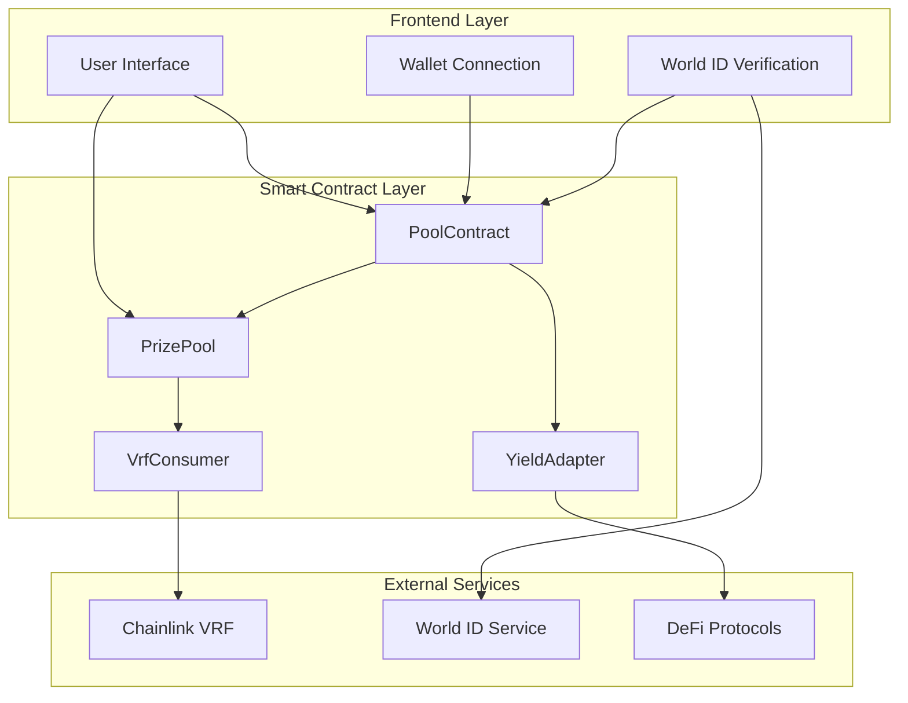
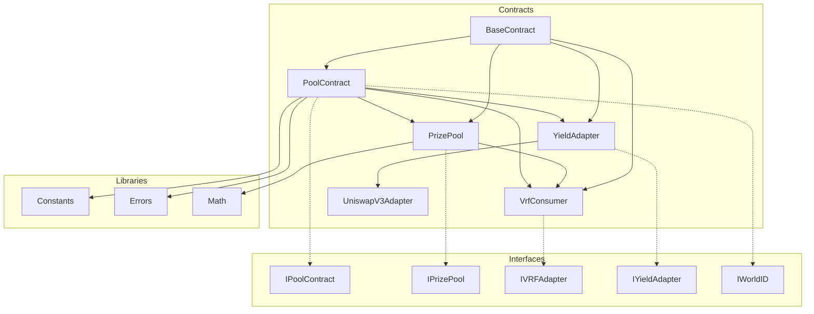
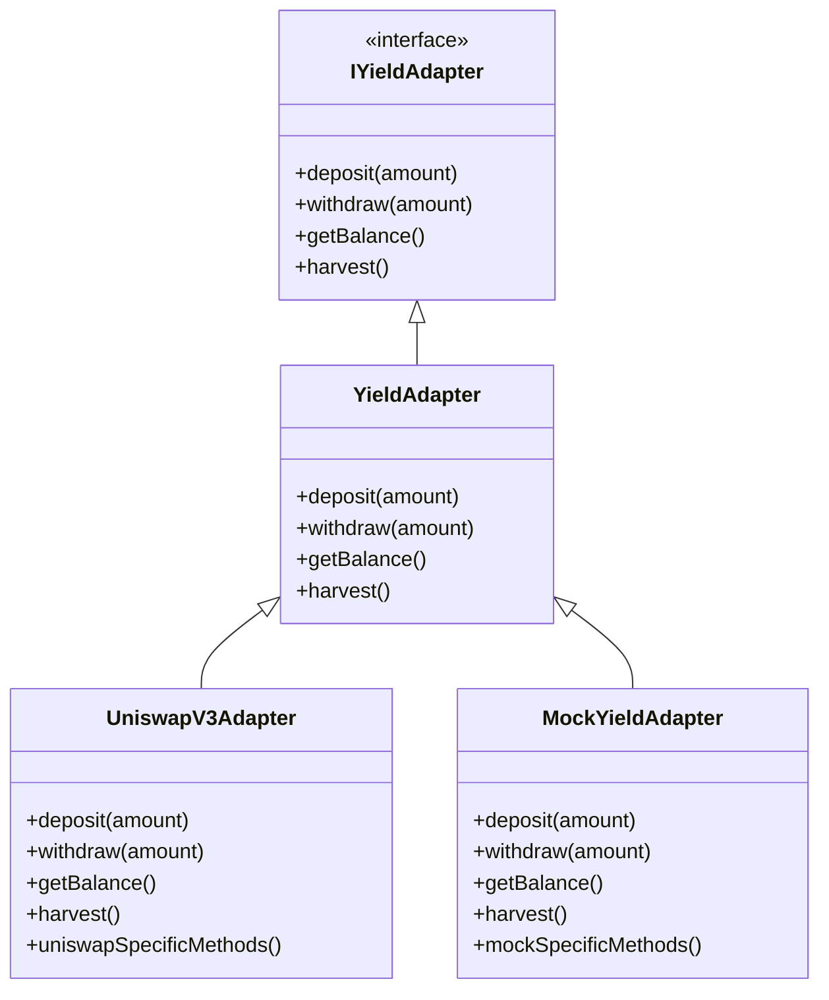
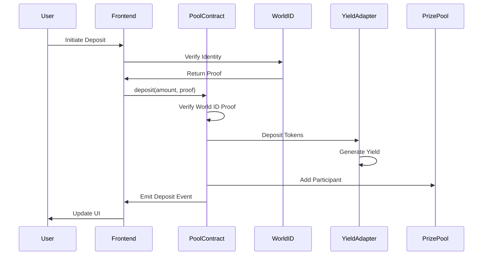
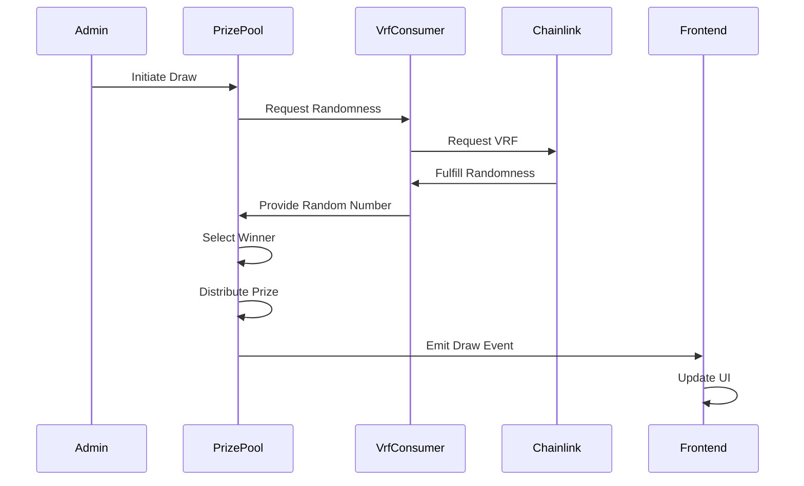

# Architecture

## Architecture Overview

The worldcoin-pooltogether-miniapp implements a **hybrid blockchain + web application architecture** with modular smart contracts and a React-based frontend. The system follows a layered architecture pattern with clear separation of concerns between different components.

## Component Interaction Flow

### 1. Frontend to Smart Contracts

- **Frontend (Next.js)** interacts with **Wagmi/Viem** for blockchain transactions
- **Wagmi/Viem** communicates with **smart contracts** on-chain using type-safe interfaces
- Real-time event listening for transaction confirmations and state updates

### 2. Smart Contract Interactions

- **Smart Contracts** emit events consumed by **frontend** for real-time updates
- **PoolContract** coordinates between all other contracts as the central hub
- **PrizePool** manages lottery logic and winner selection
- **VrfConsumer** handles secure randomness generation

### 3. External Service Integration

- **World ID Kit** handles identity verification flow with privacy preservation
- **Chainlink VRF** provides verifiable randomness for fair lottery draws
- **Sentry** captures errors and performance metrics from both frontend and backend

### 4. Yield Generation Pipeline

- **YieldAdapter** abstracts different yield generation strategies
- **UniswapV3Adapter** implements specific Uniswap V3 integration
- **MockYieldAdapter** provides testing and development environment support

## Modular Contract Architecture

## Design Patterns Implementation

### 1. Adapter Pattern

**Purpose**: Enable flexibility in yield generation strategies

- **YieldAdapter**: Base implementation with common functionality
- **UniswapV3Adapter**: Specific implementation for Uniswap V3 protocol
- **MockYieldAdapter**: Testing implementation for development environments

### 2. Proxy Pattern

**Purpose**: Enable contract upgrades and administrative controls

- **BaseContract**: Provides common administrative functionality
- **Ownable**: Administrative access control
- **Pausable**: Emergency stop functionality
- **ReentrancyGuard**: Protection against reentrancy attacks

### 3. State Channel Pattern

**Purpose**: Efficient off-chain transaction batching

- Batch multiple operations before committing to blockchain
- Reduce gas costs for frequent operations
- Maintain state consistency across operations

### 4. Event Sourcing Pattern

**Purpose**: Reliable tracking of blockchain events and transaction history

- All state changes emit corresponding events
- Frontend rebuilds state from event logs
- Provides audit trail for all operations

### 5. Error Boundary Pattern

**Purpose**: Graceful error handling in the user interface

- React Error Boundaries catch and handle runtime errors
- Fallback UI components for error states
- Error reporting integration with Sentry

## Data Flow Architecture

### Deposit Flow

### Lottery Draw Flow

## Security Architecture

### Multi-Layer Security Approach

1. **Smart Contract Security**

   - OpenZeppelin battle-tested contracts
   - Custom security analysis with Slither
   - Comprehensive test coverage (>90%)
   - Formal verification for critical functions

2. **Identity Verification Security**

   - World ID integration for Sybil resistance
   - Zero-knowledge proof verification
   - Nullifier tracking to prevent double-spending

3. **Randomness Security**

   - Chainlink VRF for verifiable randomness
   - Cryptographically secure random number generation
   - Transparent and auditable randomness source

4. **Application Security**
   - Frontend error boundaries and validation
   - Secure environment variable management
   - Rate limiting and DDoS protection
   - Comprehensive error tracking with Sentry

## Performance Architecture

### Optimization Strategies

1. **Gas Optimization**

   - Efficient data structures and algorithms
   - Batch operations where possible
   - Custom errors instead of string reverts
   - Storage optimization patterns

2. **Frontend Performance**

   - Next.js 15 with Turbopack for fast builds
   - Code splitting and lazy loading
   - Optimized asset delivery
   - Real-time updates with minimal re-renders

3. **Caching Strategy**
   - Smart contract state caching
   - Frontend query caching
   - CDN optimization for static assets
   - Efficient event log processing

## Scalability Considerations

### Horizontal Scaling

- Microservice architecture potential
- Load balancing for frontend services
- Database sharding for transaction history
- CDN distribution for global access

### Vertical Scaling

- Contract upgrade mechanisms
- Yield adapter extensibility
- Prize pool scaling strategies
- Performance monitoring and optimization

The architecture demonstrates a careful balance between decentralization, security, and performance, providing a solid foundation for both current operations and future enhancements.
