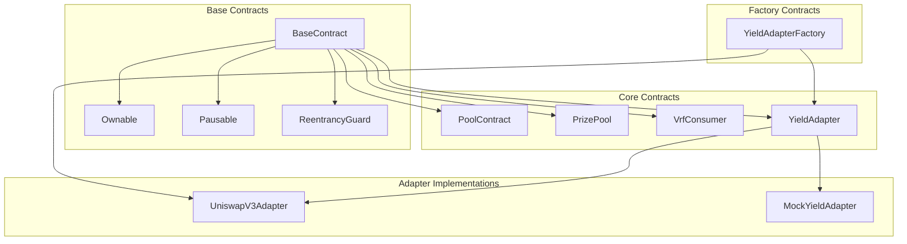
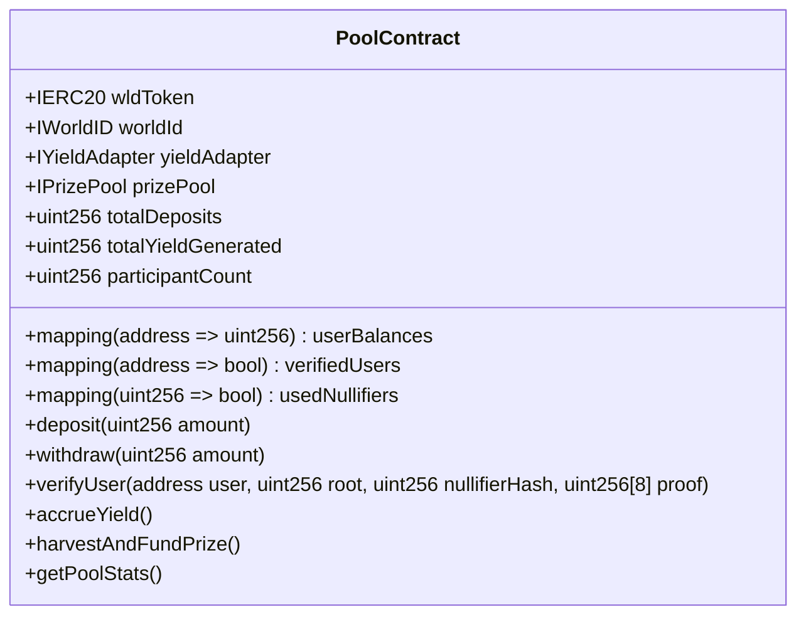
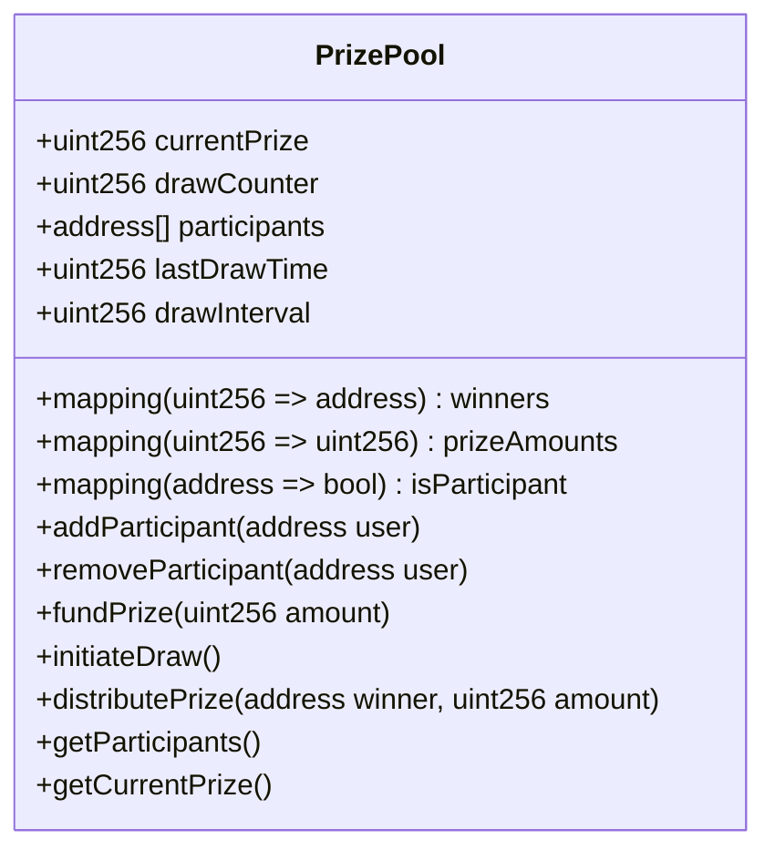
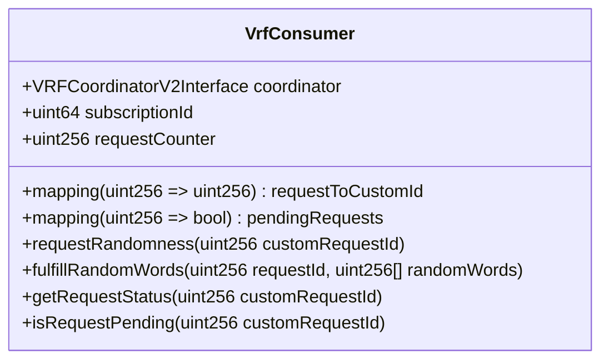
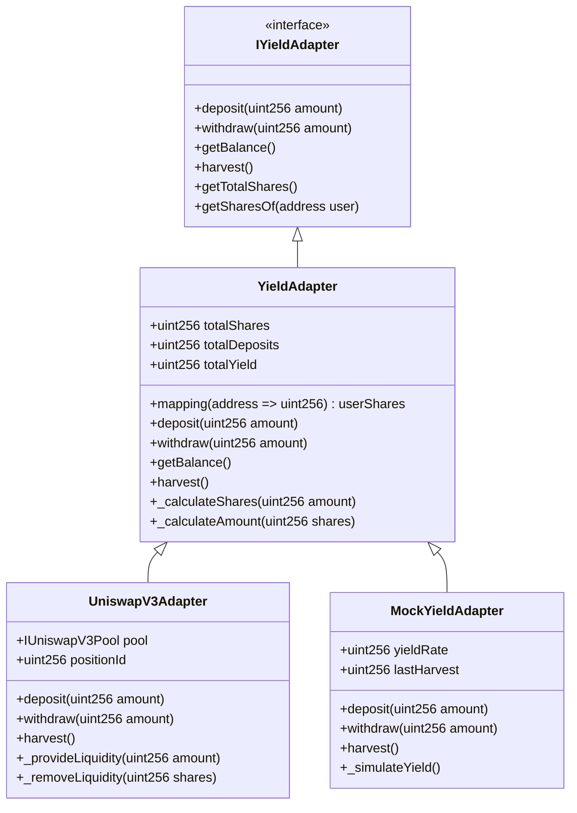

# Smart Contract Architecture

## Overview

The smart contract architecture follows a **modular design** with clear separation of concerns between different components. The system implements a no-loss lottery where user deposits are used to generate yield, which is then distributed as prizes through periodic draws. The architecture uses the adapter pattern to enable flexibility in yield generation strategies and VRF integration.

## Contract Hierarchy



## Core Components

### 1. PoolContract - Central Hub

**Purpose**: Serves as the central hub for managing user deposits and withdrawals of WLD tokens.

**Key Responsibilities**:

- User deposit and withdrawal management
- World ID verification integration
- Yield adapter coordination
- Prize pool participant management
- Automatic yield harvesting



**Core Functions**:

#### Deposit Function

1. Verify user has completed World ID verification
2. Validate deposit amount against minimum and maximum limits
3. Confirm user has sufficient token balance
4. Transfer tokens from user to contract
5. Update user and pool balances
6. Route funds to yield adapter for yield generation
7. Register user as participant in prize pool
8. Check for automatic yield harvesting
9. Emit Deposit event

#### Withdraw Function

1. Validate withdrawal amount against user balance
2. Check for minimum balance requirements
3. Request funds from yield adapter
4. Update user and pool balances
5. Transfer tokens to user
6. Remove user from prize pool if balance is zero
7. Emit Withdraw event

### 2. PrizePool - Lottery Management

**Purpose**: Manages prize distribution and lottery draw mechanics.

**Key Responsibilities**:

- Prize fund accumulation
- Participant tracking
- Winner selection logic
- Prize distribution
- Draw history management



**Prize Distribution Logic**:

- Winner selection based on verifiable randomness
- Proportional prize distribution based on participation
- Automatic prize fund management
- Historical draw tracking

### 3. VrfConsumer - Secure Randomness

**Purpose**: Provides cryptographically secure randomness for fair lottery draws.

**Key Responsibilities**:

- Chainlink VRF integration
- Randomness request management
- Request fulfillment handling
- Random number validation



**VRF Integration Flow**:

1. Prize pool initiates randomness request
2. VrfConsumer submits request to Chainlink VRF
3. Chainlink VRF generates verifiable randomness
4. VrfConsumer receives and validates randomness
5. Random number forwarded to prize pool for winner selection

### 4. YieldAdapter - Yield Generation

**Purpose**: Abstract interface for different yield generation strategies.

**Key Responsibilities**:

- Deposit management to external protocols
- Yield harvesting and tracking
- Share-based accounting
- Strategy-specific implementations



## Adapter Pattern Implementation

### Base YieldAdapter

Provides common functionality and share-based accounting:

- User share tracking
- Deposit/withdrawal calculations
- Yield accumulation
- Standard interface compliance

### UniswapV3Adapter

Implements Uniswap V3 liquidity provision:

- Liquidity position management
- Fee collection and compounding
- Price range optimization
- Impermanent loss mitigation

### MockYieldAdapter

Provides simulated yield for testing:

- Configurable yield rates
- Deterministic yield generation
- Development environment support
- Testing scenario simulation

## Security Features

### Access Control

- **Role-based permissions** using OpenZeppelin's Ownable
- **Administrative functions** restricted to contract owner
- **Emergency controls** including pause functionality
- **Upgrade mechanisms** for contract improvements

### Reentrancy Protection

- **ReentrancyGuard** implementation on all external functions
- **Checks-Effects-Interactions** pattern enforcement
- **State consistency** validation
- **External call safety** measures

### Input Validation

- **Parameter validation** for all public functions
- **Range checks** for numerical inputs
- **Address validation** for contract interactions
- **Custom errors** for gas-efficient error handling

### World ID Integration

- **Nullifier tracking** to prevent double verification
- **Proof validation** using World ID smart contracts
- **Action-specific verification** for different operations
- **Privacy preservation** through zero-knowledge proofs

## Gas Optimization Strategies

### Storage Optimization

- **Packed structs** for efficient storage usage
- **Minimal storage reads/writes** in critical functions
- **State variable ordering** for gas efficiency
- **Lazy evaluation** for expensive operations

### Function Optimization

- **Batch operations** where possible
- **Internal function calls** for code reuse
- **Custom errors** instead of string reverts
- **Event emission** for off-chain indexing

### Contract Size Optimization

- **Modular architecture** to stay under size limits
- **Library usage** for common functionality
- **Interface abstractions** for loose coupling
- **Proxy patterns** for upgradability

## Deployment Architecture

### Local Development

```bash
# Deploy all contracts locally
forge script script/Deploy.s.sol --rpc-url http://localhost:8545 --broadcast

# Deploy with specific yield implementation
YIELD_IMPL=MOCK forge script script/Deploy.s.sol --rpc-url http://localhost:8545 --broadcast
```

### Testnet Deployment

```bash
# Deploy to testnet with mock yield
YIELD_IMPL=MOCK pnpm deploy:testnet

# Deploy with Uniswap V3 adapter
YIELD_IMPL=UNISWAP_V3 pnpm deploy:testnet
```

### Production Deployment

- Multi-signature wallet for contract ownership
- Gradual rollout with monitoring
- Emergency response procedures
- Upgrade mechanisms and governance

## Testing Framework

### Unit Tests

- **Individual contract testing** with isolated environments
- **Function-level testing** for all public functions
- **Edge case coverage** for boundary conditions
- **Error condition testing** for proper error handling

### Integration Tests

- **Cross-contract interactions** testing
- **End-to-end scenarios** validation
- **State consistency** verification
- **Event emission** validation

### Security Tests

- **Invariant testing** with Echidna fuzzing
- **Static analysis** with Slither
- **Manual security review** for critical functions
- **Gas usage optimization** testing

### Performance Metrics

- **51 passing tests** across 5 test suites
- **>90% code coverage** for critical functions
- **Gas usage optimization** for all operations
- **Deployment size optimization** within limits

## Contract Interfaces

### IPoolContract

```solidity
interface IPoolContract {
    function deposit(uint256 amount) external;
    function withdraw(uint256 amount) external;
    function verifyUser(
        address user,
        uint256 root,
        uint256 nullifierHash,
        uint256[8] calldata proof
    ) external;
    function getUserBalance(address user) external view returns (uint256);
    function getTotalDeposits() external view returns (uint256);
    function isUserVerified(address user) external view returns (bool);
}
```

### IPrizePool

```solidity
interface IPrizePool {
    function addParticipant(address user) external;
    function removeParticipant(address user) external;
    function fundPrize(uint256 amount) external;
    function initiateDraw() external;
    function getCurrentPrize() external view returns (uint256);
    function getParticipantCount() external view returns (uint256);
}
```

### IYieldAdapter

```solidity
interface IYieldAdapter {
    function deposit(uint256 amount) external returns (uint256 shares);
    function withdraw(uint256 shares) external returns (uint256 amount);
    function getBalance() external view returns (uint256);
    function harvest() external returns (uint256 yield);
    function getTotalShares() external view returns (uint256);
}
```

This smart contract architecture provides a robust, secure, and flexible foundation for the no-loss lottery system, with clear separation of concerns and comprehensive security measures.
