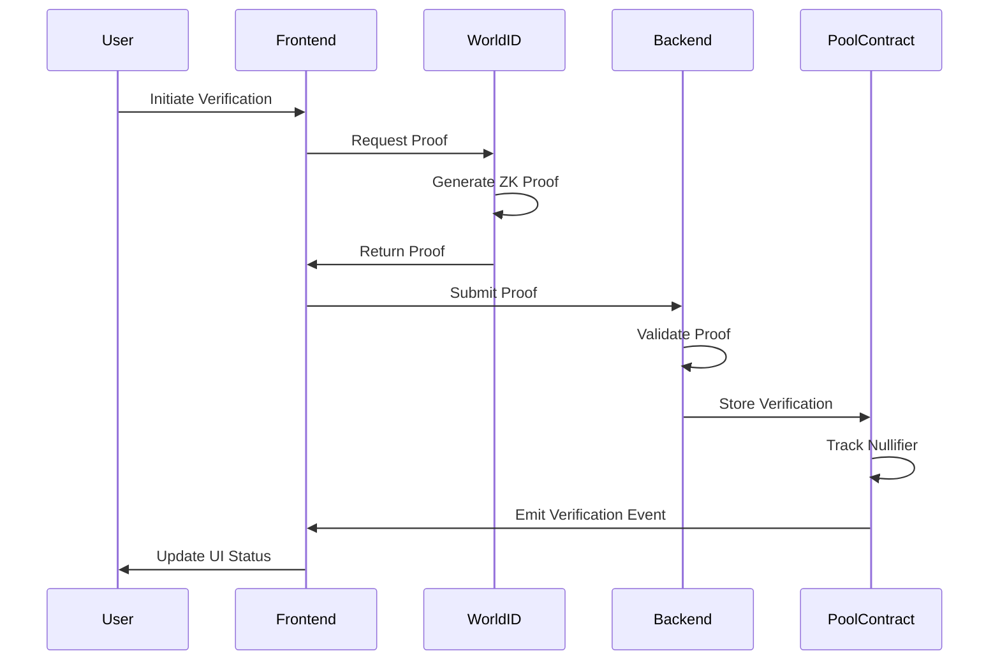
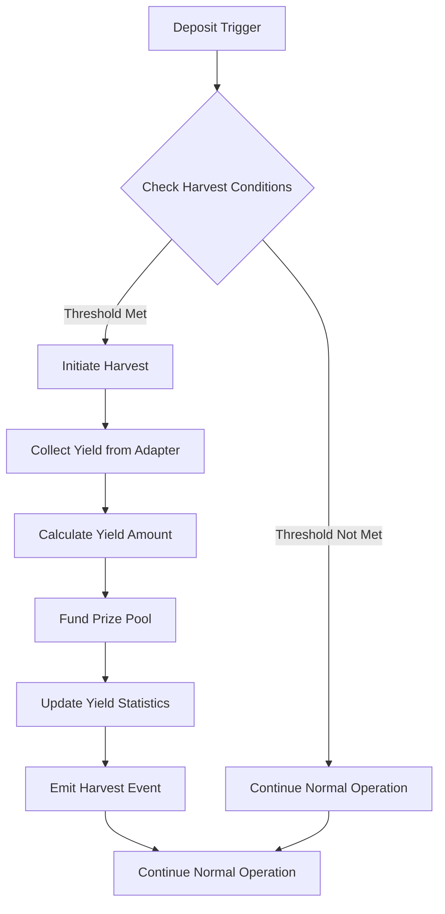
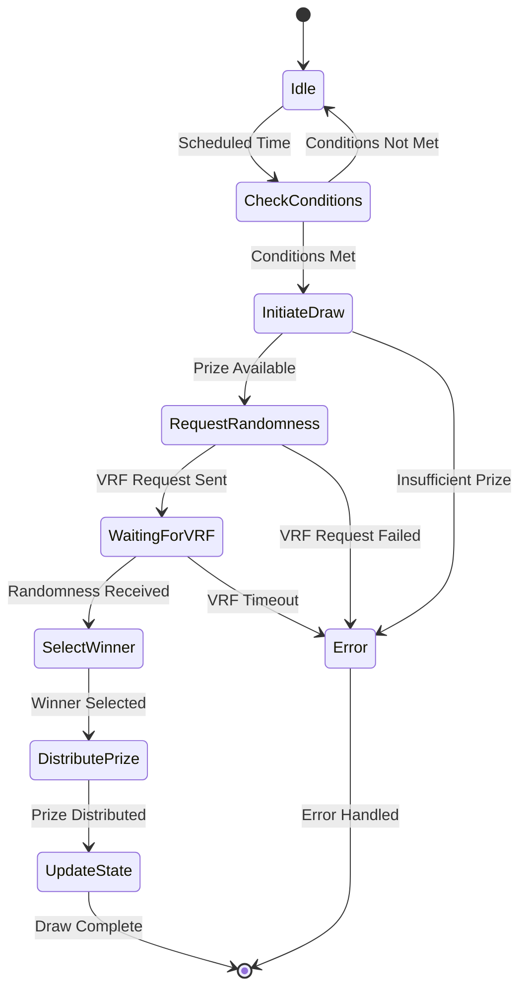
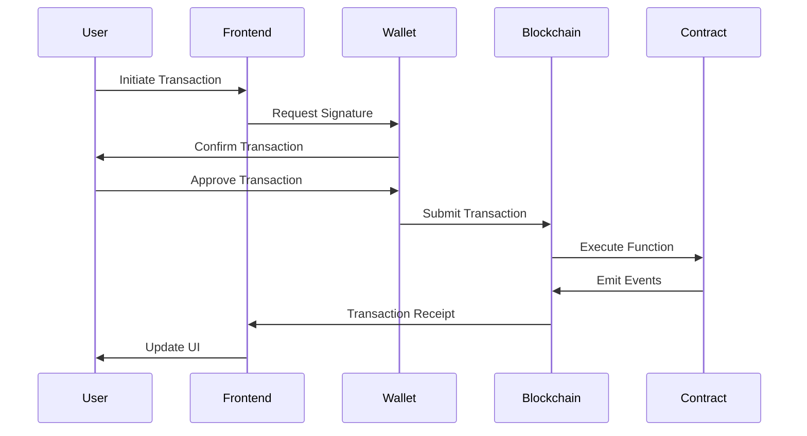

# Key Features

## World ID Integration

### Overview

The system implements a comprehensive World ID verification system that ensures one-person-one-entry fairness while preserving user privacy through zero-knowledge proofs.

### Implementation Components

#### Frontend Components

- **WorldIDVerification.tsx** - React component for World ID integration
- **IDKit integration** - Official World ID React SDK
- **Verification flow UI** - User-friendly verification process
- **Error handling** - Graceful handling of verification failures

#### Backend API Endpoints

- **Authentication API** - Server-side verification endpoint
- **Sign-In with Ethereum API** - Ethereum wallet integration
- **World ID Verification API** - Zero-knowledge proof validation

#### Smart Contract Functions

- **verifyUser()** - On-chain proof verification
- **Nullifier tracking** - Prevention of double verification
- **Action-specific verification** - Different verification levels
- **Emergency override** - Administrative controls

#### Mock Implementations

- **MockWorldID.sol** - Testing environment support
- **Development mode** - Local testing without World ID service
- **Automated testing** - Integration with test suites

### Verification Process



### Security Features

- **Zero-knowledge proofs** preserve user privacy
- **Nullifier hashes** prevent duplicate verifications
- **Action-specific verification** for different operations
- **Sybil attack prevention** through unique human verification

## Yield Generation

### Architecture Overview

The yield generation system uses the **Adapter Pattern** to support multiple yield strategies while maintaining a consistent interface.

### Supported Adapters

#### Mock Yield Adapter

**Purpose**: Development and testing environment

- **Configurable yield rates** for testing scenarios
- **Deterministic yield generation** for predictable testing
- **No external dependencies** for isolated testing
- **Simulation modes** for different market conditions

```solidity
contract MockYieldAdapter is YieldAdapter {
    uint256 public yieldRate; // Annual yield rate in basis points
    uint256 public lastHarvest;

    function harvest() external override returns (uint256 yield) {
        uint256 timeElapsed = block.timestamp - lastHarvest;
        uint256 annualizedYield = (totalDeposits * yieldRate) / 10000;
        yield = (annualizedYield * timeElapsed) / 365 days;
        lastHarvest = block.timestamp;
        return yield;
    }
}
```

#### Uniswap V3 Adapter

**Purpose**: Production yield generation through DEX liquidity provision

- **Liquidity position management** on Uniswap V3
- **Fee collection and compounding** for maximum yield
- **Price range optimization** for efficient capital usage
- **Impermanent loss mitigation** strategies

```solidity
contract UniswapV3Adapter is YieldAdapter {
    IUniswapV3Pool public pool;
    uint256 public positionId;

    function deposit(uint256 amount) external override returns (uint256 shares) {
        // Provide liquidity to Uniswap V3 pool
        shares = _provideLiquidity(amount);
        _updateShares(msg.sender, shares);
        return shares;
    }

    function harvest() external override returns (uint256 yield) {
        // Collect fees from Uniswap V3 position
        yield = _collectFees();
        _compoundFees(yield);
        return yield;
    }
}
```

### Yield Harvesting Process



### Automatic Harvesting

- **Threshold-based harvesting** when yield reaches minimum amount
- **Time-based harvesting** at regular intervals
- **Event-triggered harvesting** during deposits/withdrawals
- **Manual harvesting** for administrative control

## Automated Lottery Draws

### Draw Scheduling System

The system implements both automated and manual lottery draw mechanisms to ensure regular prize distribution.

#### Automation Components

- **CLI automation script** (`draw-tick.ts`) for draw management
- **Shell wrapper** (`draw-automation.sh`) for system integration
- **Cron job configuration** for scheduled draws
- **Error handling and recovery** for failed draws

#### Draw Process



### Draw Conditions

- **Minimum prize threshold** ensures meaningful prizes
- **Participant requirements** ensure fair competition
- **Time intervals** maintain regular draw schedule
- **Emergency controls** for system maintenance

### Winner Selection Algorithm

1. **Request verifiable randomness** from Chainlink VRF
2. **Generate random index** within participant array bounds
3. **Select winner** based on random index
4. **Validate winner eligibility** (active participant, verified user)
5. **Distribute prize** to winner's account
6. **Update draw history** and statistics

## Wallet Integration

### Supported Wallets

The system provides comprehensive wallet support through modern Web3 libraries.

#### Primary Integration

- **Wagmi + Viem** for type-safe Ethereum interactions
- **RainbowKit** for beautiful wallet connection UI
- **ConnectKit** as alternative wallet solution
- **WalletConnect** protocol support

#### Wallet Features

- **Multi-wallet support** for user choice
- **Automatic reconnection** for seamless experience
- **Network switching** for multi-chain support
- **Transaction signing** with user confirmation

### Transaction Management

#### Transaction States

```typescript
enum TransactionStatus {
  IDLE = "idle",
  PENDING = "pending",
  CONFIRMING = "confirming",
  SUCCESS = "success",
  ERROR = "error",
}
```

#### Transaction Flow



#### Error Handling

- **User rejection** - Graceful handling of cancelled transactions
- **Network errors** - Retry mechanisms and fallback options
- **Gas estimation** - Automatic gas price optimization
- **Transaction failures** - Clear error messages and recovery options

### Real-time Updates

- **Event listening** for immediate state updates
- **Optimistic updates** for responsive UI
- **Transaction confirmations** with visual feedback
- **Error recovery** mechanisms

## Additional Features

### Performance Monitoring

- **Sentry integration** for error tracking
- **Performance metrics** collection
- **Real-time alerts** for system issues
- **User experience tracking**

### User Experience Enhancements

- **Toast notifications** for all user actions
- **Loading states** during transaction processing
- **Transaction history** with detailed information
- **Error boundaries** for graceful error handling

### Administrative Features

- **Admin dashboard** for system management
- **Emergency controls** for system maintenance
- **Configuration management** for system parameters
- **Monitoring and analytics** for system health

### Security Measures

- **Input validation** on all user inputs
- **Rate limiting** for API endpoints
- **Access control** for administrative functions
- **Audit trails** for all system operations

### Scalability Features

- **Modular architecture** for easy expansion
- **Plugin system** for additional yield adapters
- **Configuration-driven** behavior
- **API versioning** for backward compatibility

This comprehensive feature set provides a robust, user-friendly, and secure platform for no-loss lottery participation while maintaining high standards for security, performance, and user experience.
